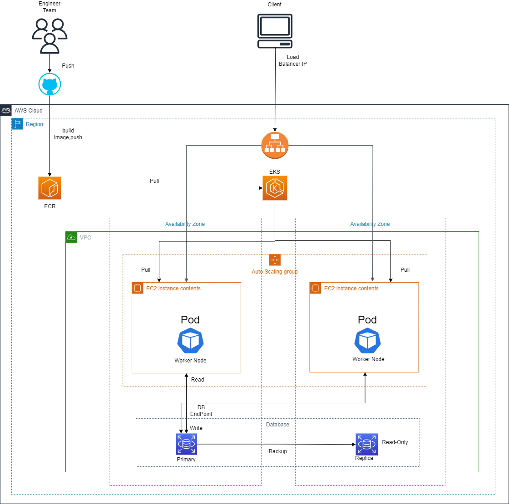

# Terraform-AWS

tạo access key và cấp quyền tối thiểu cho tài nguyên được tạo
aws configure 
<nhập access key ID và secret access key>
access vào eks cluster thông qua aws cli aws eks update-kubeconfig --name <cluster name> --region <region>
sau khi đã tạo ecr sử dụng câu lệnh sau để có quyền truy cập vào ecr và có thể push/pull image
aws ecr get-login-password \
    --region $AWS_REGION \
    --profile $AWS_PROFILE \
    | docker login \
    --username AWS \
    --password-stdin $AWS_ACCOUNT_ID.dkr.ecr.$AWS_REGION.amazonaws.com
sau đó đánh tag và push image lên ecr 
để deploy application di chuyển đến vị trí file deployment.yaml
kubectl apply -f deployment.yaml
kubectl get svc 
sau đó sử dụng url của LoadBalancer để truy cập application